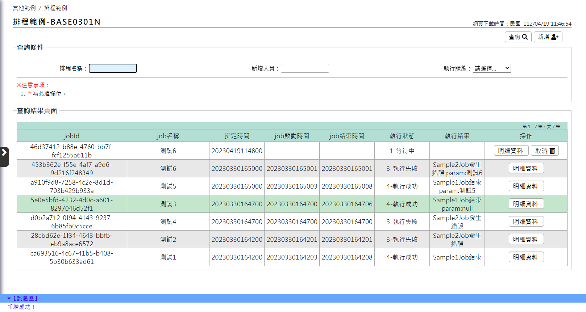

# 排程開發

## Quart簡介
Quartz是一款功能強大的開源任務排程庫,Quartz可以創建簡單或複雜的工作排程,暨彈性又準確的執行程式編寫的內容.<br>
使用DB LOCK可以確保多台電腦只有一台執行任務,避免同時重複執行Job.<br>
### JobDetail：定義任務詳情
最小單位,當觸發器觸發時,程式會去呼叫excute方法做執行,JobDetail是由使用者編寫,並在Job註冊到Scheduler時生成,並且包含Job的狀態訊息(JobDataMap),因此Quartz不儲存Job實例,而是交由JobBuilder定義和建立實例,一個Job可以對應多個Trigger..
### Job：定義任務接口
Job的介面,因此我們可以實現介面來自定義自己的任務,其中JobExecutionContext紀錄上下文的各種訊息,為了避免任務執行還未結束就被再次觸發,可以加上@DisallowConcurrentExecution來解決這個問題.
### Trigger：觸發任務執行
用於觸發Job執行,且透過JobDataMap將依些參數傳給Job運行時使用,Quartz預設有多種觸發器,其中以SimpleTrigger和CronTrigger最為經常使用.
### Scheduler：用戶與排程器溝通的API
由schedulerFactory建立,負責新增、刪除並列出所有的Job和Trigger

## 系統新增功能
### QuartzJob: 系統使用之Job class 
本系統有開發監控Job執行狀態功能,所有Job需extends QuartzJob.
### JobParam: Job執行時所需之參數
Job執行時所需之參數,需再新增排程時代入.
### JobService: 異動Job排程
系統用來新增,刪除Job排程

>  &lt; 開發注意事項 &gt;<br>
> 所有Job需 extends QuartzJob<br>
> Job所需參數請使用JobParam帶入<br>
> 使用JobService 新增,刪除Job排程<br>
>
## 重複性排程
系統定時排程Job. 設定在QuartzConfig中.
```java
public class QuartzConfig {
    // 先設定Job detail
    @Bean
    public JobDetailFactoryBean repeatJobDetail() {
        // 略...
    }
    // 將Job detail 設定Trigger時間
    @Bean
    public CronTriggerFactoryBean repeatTrigger(JobDetail repeatJobDetail) {
        // 略...
    }
    // 使用Scheduler 將Trigger排入排程
    @Bean 
    public SchedulerFactoryBean scheduler(CronTrigger repeatTrigger) {
        // 略...
    }
}
```
## 一次性排程
使用者自行排定的Job.使用JobService 新增,刪除排程.<br>
會自動新增資料到DB的schedule中以便查詢Job狀態<br>
```java
public class Base0301Service {
    // 略...
    public void insertSchedule(Base0301Case caseData) throws Exception {
        String className =
                StringUtils.join("tw.gov.idb.base.job.onceJob.", caseData.getAddAndQueryCase().getJobClassName());
        Class<?> clazz = Class.forName(className);
        // 取得Job排程參數
        JobParam jobParam =
                getJobParam(caseData.getAddAndQueryCase().getScheduleTime(), caseData.getAddAndQueryCase().getJobName(),
                        caseData.getAddAndQueryCase().getDescription(), userBean.getUserId());
        // 設定Job執行時所需資訊
        jobParam.getJobParamMap().put(QuartzJob.PARAM_KEY, caseData.getAddAndQueryCase().getParam());
        // 排定Job
        jobService.addJob(jobParam, (Class<? extends QuartzJob>) clazz);
    }
}
```
### 一次性排程監控功能
系統有監控排程執行狀態功能,請參考web的排程範例.<br>

