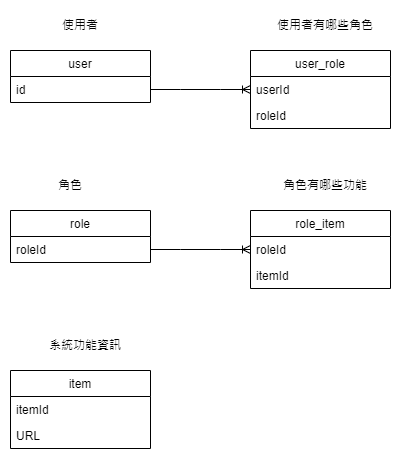
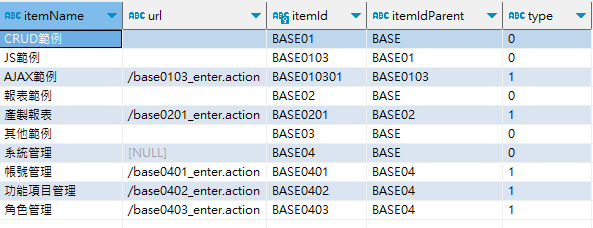
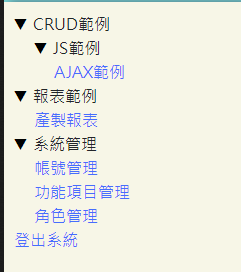

# 系統權限設定

## 系統權限相關table

| TBALE 名稱  | 說明     |
|:----------|:-------|
| item      | 功能資訊   |
| user      | 使用者資訊  |
| role      | 角色資訊   |
| user_role | 使用者角色表 |
| role_item | 角色功能表  |

## table 關係圖

## item(系統功能資訊)

存放本系統所有功能基礎URL,因為畫面功能項為樹狀結構,所以item資料也為樹狀結構. 
root為BASE(levelNo=0),第一層(levelNo=1)為功能大項,依次往下展開 
詳細欄位說明可以參考DB欄位註解
>  &lt; 開發注意事項 &gt; 
> URL有固定格式：  ***/功能編號_enter.action*** 
> 後續系統檢驗授權是檢查  ***/功能編號_XXXX.action*** 
> 即 ***/功能編號_*** 開頭的URL都視為合法URL
>
例如以下為SYS的權限選單,系統畫面左邊選單就會根據資料顯示,並且以下開頭的URL皆為合法URL 
/base0103_ 
/base0201_ 
/base0401_ 
/base0402_ 
/base0403_ 

>  &lt; 開發注意事項 &gt; 
> type：表示該項目為功能(1)還是目錄(0) 
> URL：只有功能才有值 
> itemId：功能編號 
> itemIdParent：父節點功能編號 
>

### WEB頁面根據上面的資料產生的功能列表

## 系統新增功能步驟

- 先到 ***功能項目管理*** 建立功能資訊
- 到 ***角色管理*** 開啟執行新功能權限

## 系統新增角色步驟

- 到 ***角色管理*** 建立新角色
- 到 ***角色管理*** 設定新角色可用的功能

## 系統新增使用者步驟

- 到***帳號管理***新增使用者並選擇使用者角色資訊

> 目前帳號管理只有單一使用者指定單一角色 
> 可視情況將頁面修改為單一使用者多角色 
> 底層系統是可以支援多角色
>

