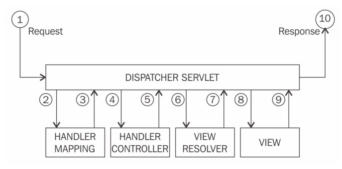
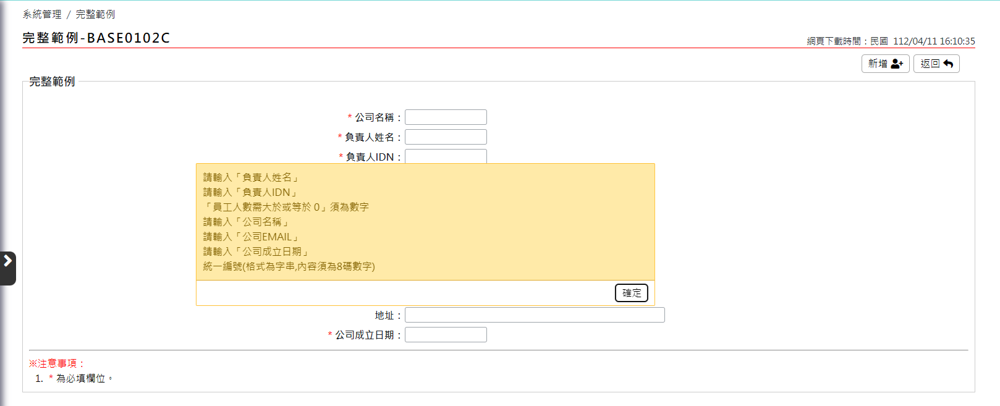
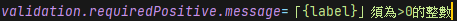
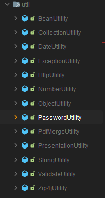

# 系統開發說明
開發一個功能通常會寫以下幾個檔案

| 名稱         | 說明                            | 檔案格式 |
|:-----------|:------------------------------|:-----|
| JSP        | WEB頁面顯示                       | JSP  |
| Controller | 處理頁面資訊以及導頁                    | JAVA |
| Case       | JSP跟Controller之間傳遞資訊物件(Model) | JAVA |
| Service    | 業務邏輯以及DB相關操作                  | JAVA |
| Domain     | DB資訊物件 (ORM)                  | JAVA |
| Dao        | Mybatis 操作DB資訊                | JAVA |
| Xml        | Mybatis 存放SQL檔案               | XML  |


## MVC架構


> 以本系統來說<br>
`M` 對應到 `case`(JSP跟controller之間傳遞資訊物件) `domain`(service跟資料庫查詢資訊物件)<br>
`V` 對應到 `JSP`<br>
`C` 對應到 `controller`
>

## SPRING MVC 流程



### RequestMapping
以下程式碼代表頁面 URL:/base0102_enter.action 會執行此段程式碼<br>
執行完導向頁面為 /base0102/base0102n.jsp<br>

```java
public class Base0102Controller extends BaseController {
    public static final String QUERY_PAGE = "/base0102/base0102n";
    // WEB頁面URL:/base0102_enter.action 會執行此段程式碼
    @RequestMapping("/base0102_enter.action")
    public String enter(@ModelAttribute(CASE_KEY) Base0102Case caseData) {
        resetCaseData(caseData);
        // 返回頁面URL:/base0102/base0102n
        return QUERY_PAGE;
    }
}
```

### JSP & Javascript
#### JSP樣板
使用`modelAttribute`指定`model`名稱<br> 
使用`path`語法指定要存到`model`的屬性<br>
例如下面的:companyName,owner 
```html
<!-- 略 -->
    <!-- 設定本頁面名稱,APLOG會顯示 -->
    <acl:setProgId progId="BASE0102N"/>
<!-- 略 -->
<form:form action="" modelAttribute="base0102" id="sessionForm">
    <fieldset>
        <legend>查詢項目</legend>
        <table class="form-table mx-auto">
            <tr>
                <th width="40%">公司名稱：</th>
                <td width="60%">
                    <form:input path="companyName" type="text" class="textinput" size="14"/>
                </td>
            </tr>
            <tr>
                <th width="40%">負責人姓名：</th>
                <td width="60%">
                    <form:input path="owner" type="text" class="textinput" size="14"/>
                </td>
            </tr>
        </table>
    </fieldset>
</form:form>
<!-- 略 -->
<script>
    $(document).ready(function () {
        // default open menu
        $(".sidenav-button").trigger("click");
        <!-- 查詢 submit -->
        $('#queryBtn').click(function () {
            $('#sessionForm').attr('action', '<c:url value="/base0102_query.action" />').submit();
        });
        <!-- 新增 submit -->
        $('#addBtn').click(function () {
            $('#sessionForm').attr('action', '<c:url value="/base0102_enterAdd.action" />').submit();
        });
    });
</script>
```
>  &lt; 開發注意事項 &gt;<br>
> 開發JSP請使用index.jsp當作樣板<br>
> 並且使用<acl:setProgId progId="XXX"/>指定每個JSP頁面名稱<br>
> 頁面submit使用Jquery `.click`事件綁定寫法<br>
> 使用Jquery操作DOM,避免使用原生方法.
> 

#### Datatable設定
getDataTablesConfig可以取得預設Datatable設定,並且根據需求變更設定. <br>
可參考官網說明:https://datatables.net/reference/option/ <br>
```JavaScript
 var config = getDataTablesConfig();//取得預設Datatable設定
 config.pageLength = 10; // 變更每頁筆數
 var oTable = $('#dataTable').DataTable(config);//啟用Datatable功能
```
#### Ajax使用
統一使用Jquery方式呼叫.
```JavaScript
 $.ajax({
    type: 'POST',
    contentType : "application/json",
    dataType:'json', 
    url: 'CommondAjax_cityArea.action',// ajax呼叫網址
    // 呼叫成功事件        
    success: function (data) { 
        // do something
    },
    // 呼叫失敗事件
    error: function (jqXHR, textStatus, errorThrown) {
        // do something
    }
 });
```


### Case(Model)物件
頁面path指定的資料會被 SPRING MVC 寫入Base0102Case中的companyName,owner
```java
public class Base0102Case extends BaseCase implements Serializable {
    private static final long serialVersionUID = -952222987191779948L;
    private String companyName;// 公司名稱
    private String owner;// 負責人姓名
}
```
>  &lt; 開發注意事項 &gt; <br>
> 所有Model都必須繼承`BaseCase`跟實作`Serializable` <br>
> 本系統已設定所有Model都存放在`Http Session`中 <br>
>

#### model class 開發原則
因為一個功能項目通常會有新增、查詢、修改等子功能.每個子功能所需的屬性不相同.
model class 也會根據需求建立自己的inner static class
```java
public class Base0102Case extends BaseCase implements Serializable {
    // 查詢用屬性
    private String companyName;
    private String owner;
    // 查詢結果用屬性
    private List<Base0102qCase> base0102qCases;
    // 新增修改用屬性
    private AddAndUpdCase addAndUpdCase;
    //.... 略
    // 查詢結果用 Model Class
    public static class Base0102qCase {
        //.... 略
    }
    // 新增修改用 Model Class
    public static class AddAndUpdCase {
        //.... 略
    }
}
```


### controller 物件
Class使用 `@SessionAttributes` 指定 `model` 在Session中的名稱<br>
Method使用 `@ModelAttribute(CASE_KEY)` 當參數即可取得<br>
頁面 URL:/base0102_enter.action 會執行此段程式碼<br>
回傳值(QUERY_PAGE)告訴SPRING MVC要到哪一個JSP頁面

```java
// 指定本功能存放在Http Session中的物件名稱
@SessionAttributes(Base0102Controller.CASE_KEY)
public class Base0102Controller extends BaseController {
    public static final String CASE_KEY = "base0102";
    public static final String QUERY_PAGE = "/base0102/base0102n";
    // WEB頁面URL:/base0102_enter.action 會執行此段程式碼
    @RequestMapping("/base0102_enter.action")
    public String enter(@ModelAttribute(CASE_KEY) Base0102Case caseData) {
        resetCaseData(caseData);
        // 返回頁面URL:/base0102/base0102n
        return QUERY_PAGE;
    }

    // 產生本功能存放在Http Session中的物件
    @Override
    @ModelAttribute(CASE_KEY)
    public Base0102Case getCaseData() {
        return new Base0102Case();
    }
    
    // 重設本功能存放在Http Session中的物件內容. 通常在進入功能時呼叫
    private void resetCaseData(Base0102Case caseData) {
        BeanUtility.copyProperties(caseData, new Base0102Case());
    }
    // 略....
}
```
>  &lt; 開發注意事項 &gt;<br>
>controller需繼承`BaseController`<BR>
>並實作`getCaseData`方法,回傳class則為要使用的model class<BR>
>因為model存放在session中,每次進入功能項時需呼叫`resetCaseData`<BR>
>重新初始化model資料,以免有舊資料產生錯誤
> <BR>
>


### 取得登入者資訊
可在需要目前登入者資訊時用Autowired將`UserBean`注入.
```javai

public class CommondAjaxController extends BaseController {
    @Autowired
    private UserBean userData; // 登入系統的使用者資訊
    // 略....
}
```

## 驗證機制
SPRING MVC 提供2種驗證方式,並且顯示自訂訊息在前端頁面<br>



### framework驗證
系統內建多個資料驗證功能,在需要驗證的屬性上用@驗證功能名稱即可.<br>
詳細功能可在`tw.gov.idb.base.framework.validation`目錄下查閱.<br>
可以根據系統需求自行開發相關驗證功能.

```java
public class Base0102Case extends BaseCase implements Serializable {
    //分組驗證 valid用interface
    public interface queryValid {} // 查詢組
    public interface addAndUpdValid {} // 新增修改組

    // 略....
    @RequiredPositive(label = "資本額",groups = queryValid.class)
    private String capital;// 資本額
    
    @Valid // 標註@Valid表示此屬性需要驗證
    private AddAndUpdCase addAndUpdCase;
    // 略....
    public static class AddAndUpdCase {
        // 略....
        // 可標註多個驗證功能
        @NotEmpty(label = "負責人IDN",groups = addAndUpdValid.class)// 標註要使用哪種驗證功能及群組
        @IdNoFormat(label = "負責人IDN",groups = addAndUpdValid.class)// 標註要使用哪種驗證功能及群組
        private String ownerIdn;// 負責人IDN
        
        @RequiredPositive(label = "員工人數",groups = addAndUpdValid.class) // 標註要使用哪種驗證功能及群組
        private String persons;// 員工人數
        // 略....
    }
}
```
```java
public class Base0102Controller extends BaseController {
    // 略....
    // 指定Model驗證查詢組
    public String query(@Validated(Base0102Case.queryValid.class) @ModelAttribute(CASE_KEY) Base0102Case caseData,BindingResult result) {
        // 略....
    }
    // 指定Model驗證新增修改組
    public String add(@Validated(Base0102Case.addAndUpdValid.class) @ModelAttribute(CASE_KEY) Base0102Case caseData, BindingResult result) {
        // 略....
    }
    // 略....
}
```
>  &lt; 開發注意事項 &gt; <br>
> 可以在屬性上標註多個驗證功能 <br>
> 開發請使用分組驗證功能 <br>
> 

#### 驗證訊息說明
驗證訊息放在`ValidationMessages.properties`中,可使用annotation參數帶入.<br>
例如: <br>


顯示訊息會將 `員工人數` 帶入{label}中.變成 `「員工人數」須為>0的整數`

### 個別功能驗證
在controller中自己寫驗證功能.並可以搭配framework驗證方法.
```java
@SessionAttributes(Base0102Controller.CASE_KEY)
public class Base0102Controller extends BaseController {
    @ApLog(fields = "addAndUpdCase")
    @RequestMapping("/base0102_add.action")
    // 標註@Validated 表示此Model需要執行framework驗證
    // BindingResult framework為驗證結果
    public String add(@Validated @ModelAttribute(CASE_KEY) Base0102Case caseData, BindingResult result) {
        try {
            // 執行統一編號驗證(個別功能驗證)
            if (StringUtils.isNoneBlank(caseData.getAddAndUpdCase().getUniformNumbers())) {
                valid_uniformNumbers(caseData, result);
            }
            // 有驗證錯誤(framework驗證 + 個別功能驗證),回傳頁面並顯示錯誤訊息 
            if (result.hasErrors()) {
                return ADD_UPD_PAGE;
            }
            // 略....
            return QUERY_PAGE;
        } catch (Exception e) {
            // 略....
        }
        return ADD_UPD_PAGE;
    }
    // 個別功能驗證
    private void valid_uniformNumbers(Base0102Case caseData, BindingResult result) {
        //統一編號(格式為字串,內容須為8碼數字)
        if (!(REGEXP_UNIFORMNUMBERS.matcher(caseData.getAddAndUpdCase().getUniformNumbers()).matches())) {
           // 個別功能驗證錯誤訊息加入驗證結果物件中
            result.rejectValue("addAndUpdCase.uniformNumbers", StringUtils.EMPTY,
                    "統一編號(格式為字串,內容須為8碼數字)");
        }
    }
}
```

## Service & Mybatis
### Service
Service負責業務邏輯處理與DB相關操作.同時DB `Transaction`也必須在此設定.
```java
@Service
public class Base0102Service {
    @Autowired
    private CompanyDao companyDao;
    // 此方法無transaction,每個操作都會即時更新DB.
    public boolean queryCompanyList(Base0102Case caseData) throws Exception {
       // 略....
    }
    // 此方法只查詢DB資訊,任何更新DB操作會出Exception
    @Transactional(readOnly = true)
    public void enterUpd(Base0102Case caseData) {
        // 略....
    }
    // 此方法開啟transaction,有任何Exception皆會回復原本DB資訊.
    @Transactional(rollbackFor = Exception.class)
    public void deleteCompany(Base0102Case caseData) throws Exception {
        companyDao.deleteData(
                Company.builder().id(caseData.getBase0102qCases().get(caseData.getListIndex()).getId()).build());
    }
}
```
>  &lt; 開發注意事項 &gt; <br>
> Service需要在Class上標示 `@Service` <br>
> 需在Class上標註 `@Service` <br>
> 可在Class上標註 `@Transactional(rollbackFor = Exception.class)` ,所有Method啟用transaction <br>
> 可在Method上標註 `@Transactional(rollbackFor = Exception.class)` ,此Method啟用transaction <br>
> 可在Method上標註 `@Transactional(readOnly = true)` 以免意外更新DB中的資料 <br>
>

### Mybatis
新版Mybatis不需實作DaoImpl Class.只需要Dao方法跟XML ID有對應即可.<br>
物件屬性Type也不需要標示會自動轉換JAVA屬性Type與DB欄位Type.<br>
<br>
DAO
```java
@Mapper
public interface CompanyDao {
    void insertData(Company company);
    List<Company> selectCompanys(String companyName, String owner);
    void updateData(Company company);
}
```
Domain
```java
@Alias("Company") // 標示Mybatis別名.可在XML resultType直接使用.
@Data
public class Company implements Serializable {
  // 略...
}
```
Xml
```xml
<!-- 指定這個XML為CompanyDao的SQL -->
<mapper namespace="tw.gov.idb.base.dao.CompanyDao">
<insert id="insertData" useGeneratedKeys="true" keyProperty="id">
        INSERT INTO company (companyName, owner, ownerIdn, email, website,
                             uniformNumbers, persons, capital, city, area,
                             addr, issueDate, updateTime)
        VALUES (#{companyName},
                #{owner},
                #{ownerIdn},
                #{email},
                #{website},
                #{uniformNumbers},
                #{persons},
                #{capital},
                #{city},
                #{area},
                #{addr},
                #{issueDate},
                #{updateTime})
    </insert>
    <!-- Company 為在Domain 設定的@Alias("Company") -->
    <select id="selectCompanys" resultType="Company">
        select * from company t
        <where>
            <if test="companyName != null and companyName != ''">
                AND t.companyName like concat("%", #{companyName},"%")
            </if>
            <if test="owner != null and owner != ''">
                AND t.owner like concat("%", #{owner},"%")
            </if>
        </where>
    </select>
    <!-- Company 為在Domain 設定的@Alias("Company") -->
    <update id="updateData" parameterType="Company">
        UPDATE company
        <set>
            <if test="companyName != null">
                companyName = #{companyName},
            </if>
            <if test="owner != null">
                owner = #{owner},
            </if>
            <if test="ownerIdn != null">
                ownerIdn = #{ownerIdn},
            </if>
            <if test="email != null">
                email = #{email},
            </if>
            <if test="website != null">
                website = #{website},
            </if>
            <if test="uniformNumbers != null">
                uniformNumbers = #{uniformNumbers},
            </if>
            <if test="persons != null">
                persons = #{persons},
            </if>
            <if test="capital != null">
                capital = #{capital},
            </if>
            <if test="city != null">
                city = #{city},
            </if>
            <if test="area != null">
                area = #{area},
            </if>
            <if test="addr != null">
                addr = #{addr},
            </if>
            <if test="issueDate != null">
                issueDate = #{issueDate},
            </if>
            <if test="updateTime != null">
                updateTime = #{updateTime}
            </if>
        </set>
        WHERE id = #{id}
    </update>
</mapper>
```
>  &lt; 開發注意事項 &gt; <br>
> Dao需要在Class上標示 `@Mapper` <br>
> Domain可在Class上標示 `@Alias(別名)` 方便在XML引用 <br>
> Sql update語法推薦使用上面XML的寫法.可以動態更新想要的欄位 <br>
> 開發時可以設定`Log4j2.xml`中的設定,顯示動態生成的SQL以及查詢結果<br>
> 
## cache
本系統有整合`Caffeine cache`,只需要在需要快取的method上標註即可.
### cache config
```java
public class CacheConfig {
    // Cache名稱
    public static final String CACHE_NAME = "myCache";
    @Bean
    public Caffeine caffeine() {
        // 設定Cache過期方式及時間
        return Caffeine.newBuilder().expireAfterWrite(60, TimeUnit.MINUTES);
    }
    @Bean
    public CacheManager cacheManager(Caffeine caffeine) {
        CaffeineCacheManager caffeineCacheManager = new CaffeineCacheManager();
        caffeineCacheManager.setCaffeine(caffeine);
        caffeineCacheManager.setCacheNames(List.of(CACHE_NAME));
        return caffeineCacheManager;
    }
}
```
### cache 使用方式
```java
public class CommonAjaxService {
    @Autowired
    private CityareaDao cityareaDao;
    // 標上@Cacheable 此Method就使用Cache
    @Cacheable(value = CACHE_NAME, keyGenerator = "cacheKeyGenerator")
    public Map<String, List<Cityarea>> selectCityAreaData() {
        List<Cityarea> cityareas = cityareaDao.selectCityArea();
        Map<String, List<Cityarea>> map = cityareas.stream()
                .collect(Collectors.groupingBy(t -> t.getCity(), LinkedHashMap::new, Collectors.toList()));
        return map;
    }
}
```
>  &lt; 開發注意事項 &gt; <br>
> `CacheConfig` 可依照需求設定不同Cache過期方式及時間<br>
> 使用 `@Cacheable` 一定要加上keyGenerator = "cacheKeyGenerator" <br>
> 

## Lombok
Lombok 是一個 Java library,可以透過簡單的注解省略 Java 的 code,像是 setter、getter、Constructor…等<br>
常用有以下幾個,其他請參閱官網說明: https://projectlombok.org/features/ <br>
@Data
@NoArgsConstructor
@AllArgsConstructor
@Builder

## utility 說明

在 `util` package中已經有建立常用的開發utility,請優先使用以避免重複建立相同功能的程式.

